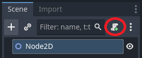
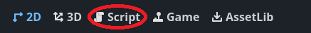

# Goals
This lesson aims to install the development environment.
## What is a development environment?

A development environment is a collection of tools and software that allows you to create, test, and debug your games. For game development with Godot and GDScript, your development environment typically includes:

- **Game Engine**: Godot Engine - the core application where you build your game
- **Code Editor**: Godot's built-in script editor for writing GDScript code
- **Version Control**: Git for tracking changes to your project files
- **Asset Tools**: External programs for creating sprites, sounds, and other game assets
- **Testing Tools**: The Godot debugger and profiler for finding and fixing issues

A properly configured development environment helps you work efficiently and maintains all your project files in one organized workspace.

# Install the development environment

## Installing Godot Engine

### Windows

1. Visit the official Godot website: [https://godotengine.org/download](https://godotengine.org/download)
2. Download the **Godot 4.5.1** version for Windows (Standard version recommended)
3. Extract the downloaded ZIP file to a location of your choice (e.g., `C:\Godot`)
4. Run `Godot_v4.5.1-stable_win64.exe` - no installation required, it's portable
5. (Optional) Create a desktop shortcut for easy access

### macOS

1. Visit the official Godot website: [https://godotengine.org/download](https://godotengine.org/download)
2. Download the **Godot 4.5.1** version for macOS
3. Open the downloaded DMG file
4. Drag the Godot application to your Applications folder
5. When first launching, right-click the app and select "Open" to bypass Gatekeeper security
6. (Optional) Add Godot to your Dock for quick access

## Installing GitHub Desktop

### Windows

1. Visit the GitHub Desktop website: [https://desktop.github.com](https://desktop.github.com)
2. Click **Download now**
	* Select **Download for Windows (64bit)**
3. Run the downloaded installer (`GitHubDesktopSetup-x64.exe`)
4. Sign in with your GitHub account (create one at [github.com](https://github.com) if needed)
5. Configure your name and email for commits

### macOS

1. Visit the GitHub Desktop website: [https://desktop.github.com](https://desktop.github.com)
2. Click **Download for macOS**
3. Open the downloaded ZIP file
4. Drag GitHub Desktop to your Applications folder
5. Launch GitHub Desktop from Applications
6. Sign in with your GitHub account (create one at [github.com](https://github.com) if needed)
7. Configure your name and email for commits

## Verify Your Installation

- Launch Godot Engine and ensure the Project Manager appears
- Open GitHub Desktop and confirm you can see the main interface
- You're now ready to start creating games with Godot!

# Test your setup

Let's verify that everything is working correctly by creating a simple "Hello, World!" project.

## Create Your First Godot Project

1. Launch Godot Engine
2. In the Project Manager, click **+ Create**
3. Choose a project name (e.g., "HelloWorld")
4. Select a location to save your project
5. Set the **Renderer** to **Forward+**
6. Make sure **Edit now** is pressed
7. Press **Create**

## Create a Scene with a 2D Node

1. In the Scene panel (top-left), click **2D Scene**
2. Navigate to **Scene** → **Save Scene**
3. Name it "main.tscn" and save

## Add a Script

1. With Node2D selected, click the **Attach Script** button (scroll icon) in the toolbar  

2. Keep the default settings and click **Create**
3. Open the script editor by clicking **Script** button  

4. In the script editor, replace the contents with:

```gdscript
extends Node2D

func _ready():
    print("Hello, World!")
```

4. Save the script with `Ctrl+S` (Windows) / `Cmd+S` (macOS)

## Run Your Project

1. Click the **Play** button (▶) in the top-right corner, or press `F5`
2. If prompted, select "main.tscn" as the main scene
	* If the main scene is open, you can press **Select current** button
3. An empty game window will appear
4. Check the **Output** panel at the bottom of the Godot editor
5. You should see "Hello, World!" printed in the console

**Success!** If you see "Hello, World!" in the output, your development environment is properly set up and you're ready to start learning Godot and GDScript!
